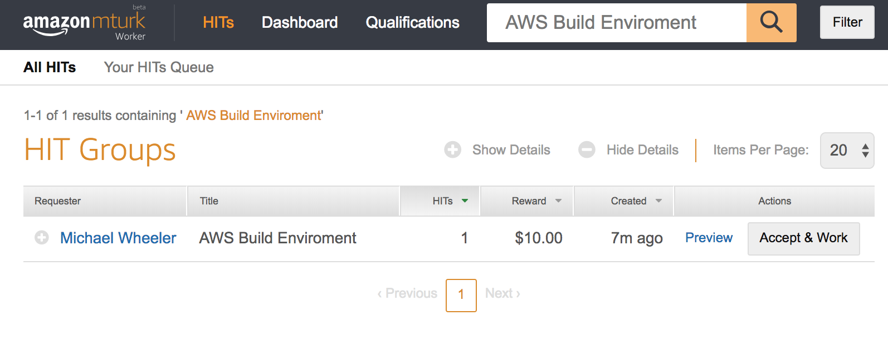

Ever wanted to build an awesome AWS enviroment only to find the service you want to use doesn't support CloudFormation. Sick of UPDATE_FAILED_ROLLBACK_FAILED

Worry not as cf-hit is the perfect solution to ALL your AWS problems.

cf-hit allows you to write natural human enviroment descriptions and have Amazon deploy out the required enviroment. 

Simply update template.yaml with your requirements:
```
SetupStack:
Type: Custom::CFHit
Properties:
    ServiceToken: !GetAtt HITLambda.Arn
    Reward: "10.00"
    Description: "Build an S3 bucket with the name potato-turk"
    TurkEndpoint: "https://mturk-requester-sandbox.us-east-1.amazonaws.com" #we are using the mturk sandbox url for testing
    Role: !GetAtt TurkRole.Arn
    SNS: !Ref TurkSNS
```

Then package the template, and deploy:
```
zip ./script.zip script.py
aws cloudformation package --template-file template.yaml --s3-bucket somerandombucket --output-template-file packaged.yaml
aws cloudformation deploy --template-file ./packaged.yaml --stack-name EasyBucket --capabilities CAPABILITY_IAM
```

CloudFormation will deploy out the template and lodge a mechnical turk task to complete the stack setup. STS access is provisioned so that the HIT can log into your AWS account to build your infrastructure.

After the HIT user marks the task as complete the stack is updated to complete.




